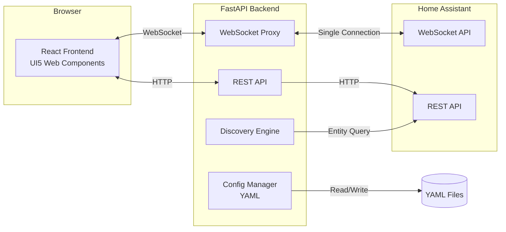
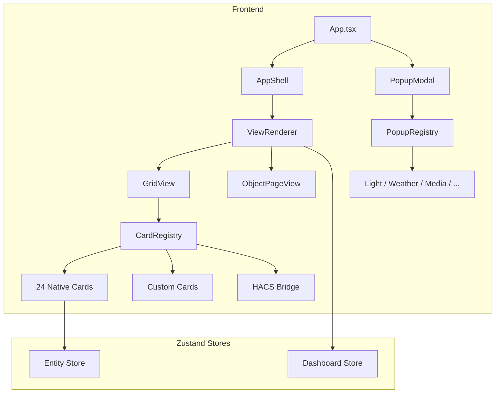

# das-home

Home Assistant Dashboard built with SAP UI5 Web Components.

[](https://github.com/conuti-das/das-home/actions/workflows/ci.yml)

## Features

- **24+ card types** with auto-discovery from HA entities
- **Widget wizard** for drag & drop configuration
- **Popup system** for detailed entity control (lights, media, weather, vehicles)
- **Area views** with tab navigation and bottom toolbar
- **Custom cards**: Area, Pill, Radar, Trash, Vehicle, LightSlider
- **HACS custom card bridge** for embedding HACS cards
- **Dark/Light theme** via SAP UI5 theming engine
- **Ingress support** for seamless HA sidebar integration

## Architecture





## Install as Home Assistant Add-on

1. **Settings** > **Add-ons** > **Add-on Store**
2. Three-dot menu top right > **Repositories**
3. Add repository URL:
   ```
   https://github.com/conuti-das/das-home
   ```
4. Click **Add**, then install the **das-home** add-on

[](https://my.home-assistant.io/redirect/supervisor_add_addon_repository/?repository_url=https%3A%2F%2Fgithub.com%2Fconuti-das%2Fdas-home)

## Install with Docker

```bash
docker run -d \
  -p 5050:5050 \
  -e DAS_HOME_HASS_URL=http://homeassistant.local:8123 \
  -e DAS_HOME_HASS_TOKEN=your_token \
  -v das-home-data:/data \
  ghcr.io/conuti-das/das-home:latest
```

Or with Docker Compose:

```bash
git clone https://github.com/conuti-das/das-home.git
cd das-home
cp .env.example .env  # Set your HA URL and token
docker-compose up -d
```

## Development

```bash
# Backend
cd backend && python -m uvicorn app.main:app --port 5050 --reload

# Frontend (separate terminal)
cd frontend && pnpm dev
```

## Tech Stack

| Layer | Technology |
|-------|-----------|
| Frontend | React 19, TypeScript, Vite, UI5 Web Components |
| State | Zustand |
| Backend | Python 3.11+, FastAPI |
| Realtime | WebSocket proxy (single HA connection, N browser clients) |
| Config | YAML persistence with Pydantic models |
| Deploy | Docker, HA Add-on with Ingress |

## License

MIT License - see [LICENSE](LICENSE)

---

# das-home (Deutsch)

Home Assistant Dashboard mit SAP UI5 Web Components.

## Funktionen

- **24+ Karten-Typen** mit Auto-Discovery aus HA-Entities
- **Widget-Wizard** fuer Drag & Drop Konfiguration
- **Popup-System** fuer detaillierte Entity-Steuerung (Licht, Medien, Wetter, Fahrzeug)
- **Area-Views** mit Tab-Navigation und Bottom-Toolbar
- **Custom Cards**: Area, Pill, Radar, Muellabfuhr, Fahrzeug, LightSlider
- **HACS Custom Card Bridge** zum Einbinden von HACS-Karten
- **Dark/Light Theme** via SAP UI5 Theming
- **Ingress-Support** fuer nahtlose HA-Sidebar-Integration

## Installation als Home Assistant Add-on

1. **Einstellungen** > **Add-ons** > **Add-on Store**
2. Drei-Punkte-Menu oben rechts > **Repositories**
3. Repository-URL einfuegen:
   ```
   https://github.com/conuti-das/das-home
   ```
4. **Add** klicken, dann das Add-on **das-home** installieren

## Installation mit Docker

```bash
docker run -d \
  -p 5050:5050 \
  -e DAS_HOME_HASS_URL=http://homeassistant.local:8123 \
  -e DAS_HOME_HASS_TOKEN=dein_token \
  -v das-home-data:/data \
  ghcr.io/conuti-das/das-home:latest
```

## Entwicklung

```bash
# Backend starten
cd backend && python -m uvicorn app.main:app --port 5050 --reload

# Frontend starten (separates Terminal)
cd frontend && pnpm dev
```
